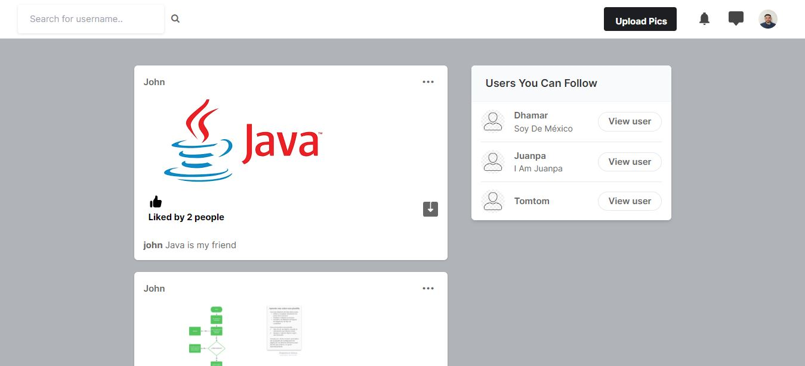

# Clone of a Social Media Platform using Django, HTML, and CSS.

## Table of contents

- [Overview](#overview)
  - [The challenge](#the-challenge)
  - [Screenshot](#screenshot)
- [My process](#my-process)
  - [Built with](#built-with)
  - [What I learned](#what-i-learned)
  - [Link](#video-reference)
- [Author](#author)
- [Acknowledgments](#acknowledgments)

## Overview

### The challenge

The challenge consists of creating a functional clone of a social media platform.

- It should have a Login and Registration window for users to authenticate.
- On the main screen, users should be able to see user suggestions, follow them, and view recently posted images.
- Users should be able to explore other users' profiles and receive a notification when someone starts following them.

### Screenshot

## My process

### Built with

- Python 3.10.6
- [Django 4.2.4](https://docs.python.org/3/library/turtle.html](https://www.djangoproject.com/)) - Python library
- [Pillow 10.0.0](https://pypi.org/project/Pillow/) - Python Library

### What I learned

I have learned how to create forms, connect the backend to the SQLite database, and gained knowledge about building more scalable Django projects. Additionally, I've grasped the way front-end and back-end are interconnected.

## Video reference

- [Freecodecamp Django crash course](https://www.youtube.com/watch?v=jBzwzrDvZ18&t=27194s)

## Author

- LinkedIn - [Juan Pablo Cuartas](https://www.your-site.com)
- Email - [juanpa88842@gmail.com](https://www.linkedin.com/in/juanpablocuartas/)

## Acknowledgments

I want to thank FreecodeCamp for creating excellent content
